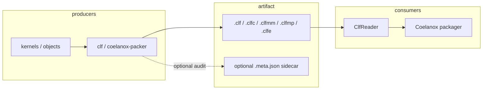

# CLF architecture (Coelanox)

This document is a single-page map of how the CLF **format**, **Rust crate**, and **tooling** fit together. For the binary layout, see [SPEC.md](../SPEC.md).

## Data flow

- **CLF file**: one header, one manifest, one blob store, optional SIG0 + SHA-256 at the end. No compression (keeps layout simple and mmap-friendly for hosts that map the file).
- **Sidecar** (`*.meta.json`): optional JSON next to the CLF with per-blob SHA-256 and labels. It is **not** part of the CLF bytes; the Coelanox stack can ignore it. Use it for audits and CI.
- **Reader** (`ClfReader` / `ClfReaderFromBytes`): parse only; no execution. The runtime consumes code already embedded in the container by the packager, not the `.clf` at inference time (see [CONSUMER_NOTE.md](CONSUMER_NOTE.md)).

## Crate layout

| Module / binary | Role |
|-----------------|------|
| `format` | `ClfHeader`, `ClfKind`, `ManifestEntry`, magic and version constants |
| `reader` | Open file or bytes, `get_blob`, `blobs_iter`, `verify_signature`, policy-based `verify_with_policy` |
| `packer` | `pack_clf`, `append_signature`, `parse_op_blob_arg` |
| `manifest_file` | TOML pack manifest for `--from` |
| `sidecar` | JSON sidecar types and writer |
| `op_registry` | `OpType` ↔ op_id mapping |
| `clf` / `coelanox-packer` | Same binary; pack, `--inspect`, `--verify`, `--dry-run`, `--write-sidecar` |

## Verification semantics

- **Current format guarantee:** SIG0 + SHA-256 integrity verification is supported today.
- **Policy scaffold:** APIs and CLI expose a `require-authenticity` mode that intentionally fails closed until authenticated signatures are added in a future format revision.

## Versioning

- **Format version** (`CLF_VERSION` in `format.rs`): bump when the on-disk layout changes; readers reject higher versions.
- **Rust MSRV**: set in the workspace `Cargo.toml` as `rust-version` (see that file for the current value).
